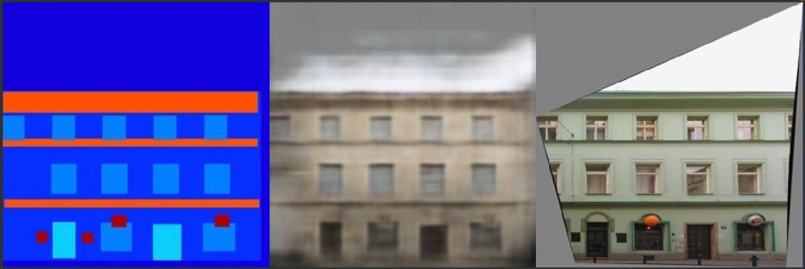
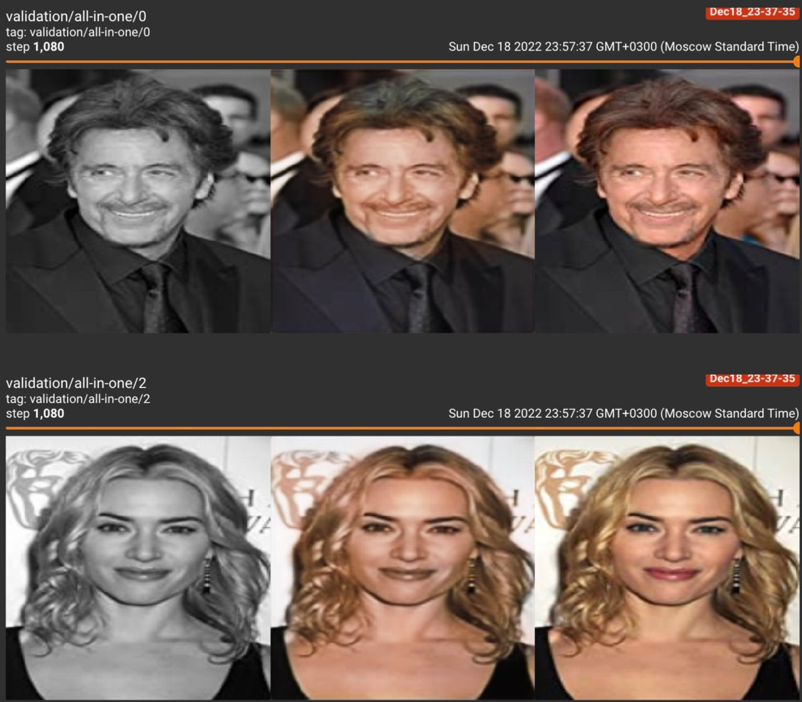
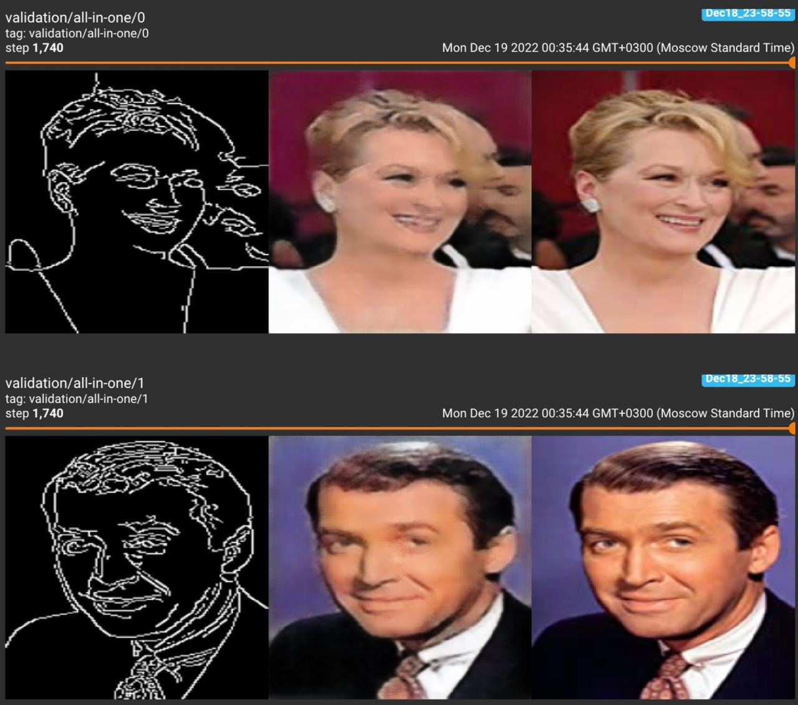
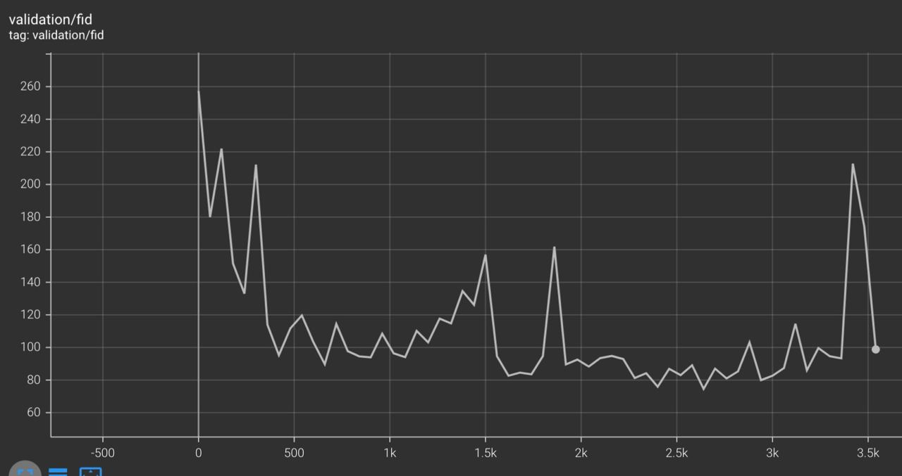

### Первая итерация
Я разобрался в принципе работы pix2pix и CycleGAN подходов и решил выбрать pix2pix, потому что он звучал проще для реализации (две сетки вместо чертырёх), пусть и лишаясь, таким образом, возможности использовать non-aligned датасеты. (Ну и CycleGAN я уже писал).

В качестве первого датасета я выбрал facades и задачу восстановления фотографии фасада дома по его сегментации. Написал загрузку и чтение датасета: без аугментаций, просто исходные 256p картинки нормализовал

Сначала я написал только простую сеть-генератор, состоящую из примитивных энкодера и декодера (свёртки, transposed свёртки, активации, residual-связи), и обучил её, используя только L1 Loss.  Это давало неплохое качество, и в целом дома соответствовали маске сегментации, но почти все время получался один и тот же желтый оттенок (то есть очень похожие дома получались).

Далее для улучшения качества, по заданию я добавил adversarial loss, дописал дискриминатор, следуя архитектуре PatchGAN, то есть сверточная архитектура, которая разбивает изображение на патчи и для каждого говорит вероятности принадлежности к real изображенияем домена. Также для улучшения качества, я дописал U-Net в качестве генераторной сети. В u-net переиспользуются feature maps с соответствующих (по размеру) слоёв, а также градиенты лучше текут.

После этих добавок, генерируемые фасады стали разнообразнее, и в целом качество меня устроило, на этом чекпойнт я закончил, примеры изображений можно увидеть в anytask.

### Вторая итерация
Часть про добавку adversarial loss я выполнил ранее и вообще пайплайн был полностью готов, поэтому далее оставалось выбрать второй датасет и дописать вычисление FID.

Хотелось собрать свой датасет, чтобы получить хоть какую-то долю бонусных баллов. Также, чтобы получить aligned-датасет для pix2pix, я решил не искать по природе aligned-датасеты (типа сегментация+исходное изображение), а найти однородный non-aligned датасет и применить к нему какое-то простое преобразование, которое затем GANом бы упрощал. Короче я походил по гуглу в поисках страниц/списков картинок, которые достаточно легко спарсить, и они мне подходили, и были достаточно интересны. В итоге остановился на вот таком топ-1000 актеров ([ссылка](https://www.imdb.com/list/ls058011111/?sort=list_order,asc&page=1)) из 10 страниц. Скачал, собрал в датасетный класс. Планировал попробовать две задачи: колоризация (получать из черно-белого снимка цветной) и восстановление изображения по sketch-у (границам). Соответственно здесь легко применяются прямые преобразования: конвертация в grayscale усреднением, а поиск границ алгоритмом Канни из opencv.

Отступление. Я баганул в парсинге и поэтому изначально имел датасет из 10 экземпляров топ-100 актеров. По той же причине у меня валидация не отличалась от обучающей выборки, и вообще сетке удалось хорошо запомнить выборку вообще. Приведу примеры в задачах колоризации и sketch-to-image, как это неплохо работало:

Починил, учиться стало тяжелее, поэтому решил работать только с задачей колоризации.

Больше результатов колоризации можно увидеть в ноутбуке или в anytask, здесь приведу только пару примеров. Есть серые артефакты, надо было почистить датасет от grayscale images

Вычисление FID я реализовал с помощью torchmetrics[image]. Для колоризации даже сохранился график, FID равен tensor(108.7438). Для фасадов FID равен tensor(194.0958).
